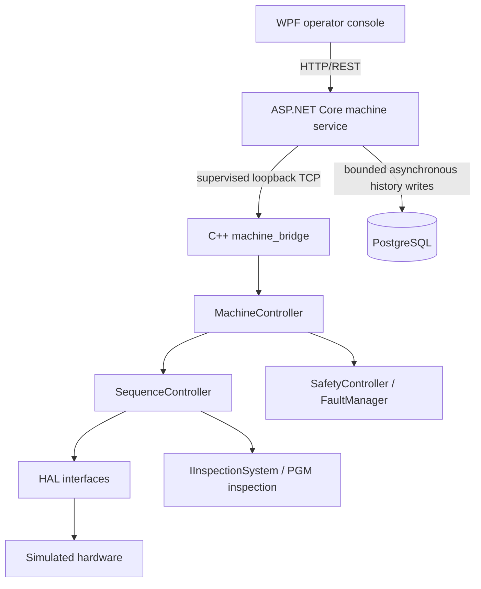

# Architecture

## Components and ownership



The C++ `MachineController` is the source of truth for live machine state. Its owner thread coordinates lifecycle, safety, sequence progression, and telemetry snapshots. `SequenceController` owns production-cycle progression and asks devices and inspection implementations to perform work through interfaces.

`machine_bridge` translates framed IPC requests into commands for the controller-owner thread. It does not create alternate state. ASP.NET owns this child process, serializes requests through `IMachineTransport`, exposes REST endpoints, observes controller transitions, and queues historical records.

PostgreSQL contains operational history and aggregate inputs only. The controller never reads it to decide whether motion or lifecycle transitions are safe. Database failure therefore degrades history endpoints while machine control continues.

WPF calls ASP.NET over REST. It displays returned telemetry and submits operator intent; it neither manages `machine_bridge` nor connects to PostgreSQL.

## Main flows

Control flow:

```text
Operator → REST command → IMachineTransport → correlated IPC request
         → C++ controller command → authoritative status response → UI
```

Persistence flow:

```text
Controller transition → ASP.NET history tracker → bounded in-memory queue
                      → background EF Core writer → PostgreSQL
```

Status polling may advance simulated cycle ticks, but only controller transitions generate history records. Repeated GET requests do not become duplicate events.

## Process lifecycle

ASP.NET starts one loopback-only bridge process, connects within a configured timeout, and disposes it during host shutdown. A timeout, closed socket, malformed response, or correlation mismatch invalidates the transport. Recovery is bounded and never replays the in-flight command. A replacement controller starts safely in `Offline`; it never resumes production automatically.

## Why loopback TCP

TCP keeps logs separate from protocol bytes and exercises the same framing and correlation code on Windows and Linux. Named pipes would require platform-specific implementations, while gRPC would add schema/tooling weight without improving this local single-client boundary. The bridge binds only to `127.0.0.1`; this protocol is not a remote deployment interface.

## Architectural invariants

- Only C++ owns live control state.
- Simulation faults alter device behavior and are detected through normal controller logic.
- E-stop can interrupt active work and is distinct from ordinary faults.
- ASP.NET is the backend boundary and bridge-process supervisor.
- PostgreSQL unavailability cannot block a controller command.
- WPF remains a REST-only client.
